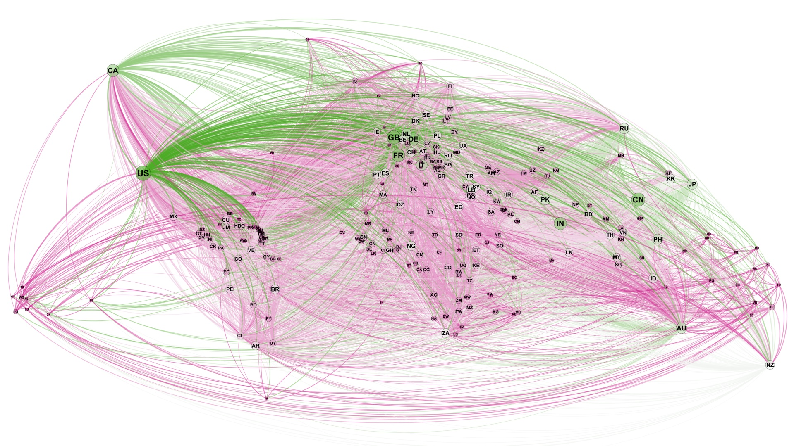

**DRAFT**

# Mapping global connections

Inspired by "Global Cities: α, β and γ tiers" map (Carta* & González 2010), we set out to visualize global connectivity using open data.

For global migration network, we used UN migrant stock data from UN's "International migrant stock: The 2017 revision"[http://www.un.org/en/development/desa/population/migration/data/estimates2/data/UN_MigrantStockByOriginAndDestination_2017.xlsx] to map source and destination of migrants. The source-destination data was processed in R and exported as csv files for visualisation in Gephi.

For airlines data, we used openflights.org data to map airplane routes. ... coming soon ...

## Source code

Full source code is available from the following GitHub repo: [https://github.com/asheshwor/global](https://github.com/asheshwor/global)

## Attribution

 **Migrant stock data:** "International migrant stock: The 2017 revision" - Table 1 tab in the data "Origin and destination" excel file [http://www.un.org/en/development/desa/population/migration/data/estimates2/data/UN_MigrantStockByOriginAndDestination_2017.xlsx]

 **Airlines data:** airlines route data and airports data from openflights.org [https://openflights.org/data.html](https://openflights.org/data.html)

 **World trade data:** BACI 2016 data [World trade database developed by the CEPII](http://www.cepii.fr/CEPII/en/bdd_modele/presentation.asp?id=1)

## License

Code distributed under the terms of the [MIT license](https://github.com/asheshwor/global/blob/master/LICENSE).

See individual licenses for external data/tools used if any.

## References

* Bastian M., Heymann S., Jacomy M. (2009). _Gephi: an open source software for exploring and manipulating networks._ International AAAI Conference on Weblogs and Social Media.

* Carta, Silvio and González, Marta (2010), _Mapping Connectedness of Global Cities: α, β and γ tiers_ [http://www.lboro.ac.uk/gawc/visual/globalcities2010.html] http://www.lboro.ac.uk/gawc/visual/globalcities2010.html
